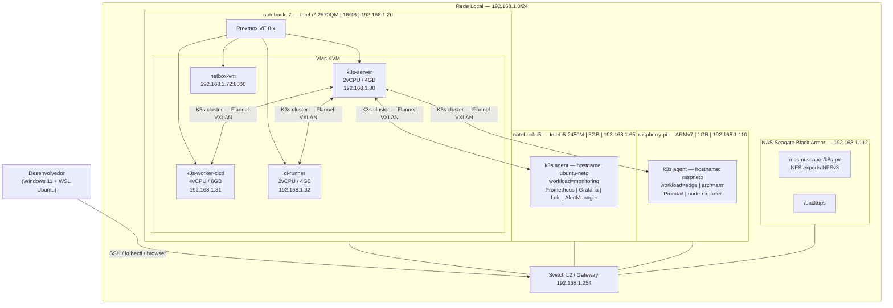
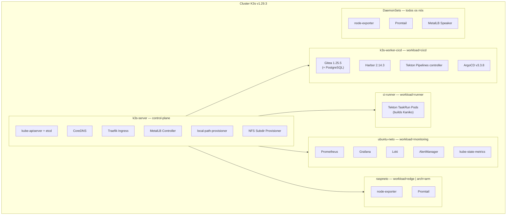
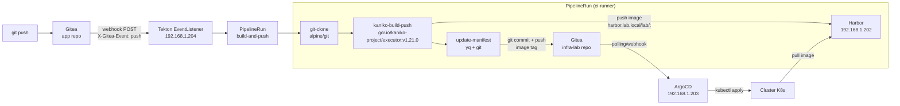
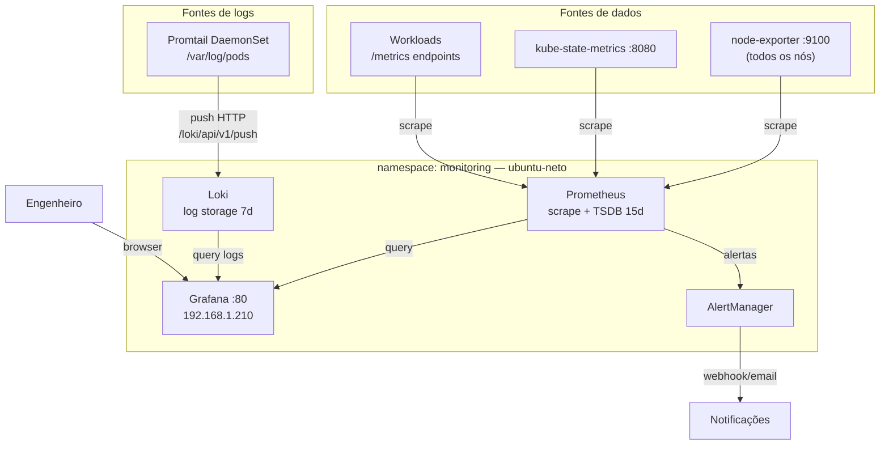

# Arquitetura do Home Lab — Referência Central

> **Versão:** 2.0.0
> **Atualizado em:** 2026-04-29
> **Responsável:** jose.mussauer@stone.com.br

---

## Sumário

1. [Visão Geral](#1-visão-geral)
2. [Inventário de Hardware](#2-inventário-de-hardware)
3. [Topologia Física](#3-topologia-física)
4. [Cluster Kubernetes](#4-cluster-kubernetes)
5. [Fluxo CI/CD](#5-fluxo-cicd)
6. [Monitoramento e Logs](#6-monitoramento-e-logs)
7. [Storage e Rede](#7-storage-e-rede)
8. [Componentes por Namespace](#8-componentes-por-namespace)

> **Decisões de design e justificativas:** ver [adr.md](./adr.md)
> **Procedimentos de instalação e operação:** ver [runbook.md](./runbook.md)

---

## 1. Visão Geral

Este laboratório executa um cluster Kubernetes K3s multi-nó distribuído em hardware heterogêneo (x86_64 e ARMv7), com pipeline CI/CD completo (Gitea → Tekton → Harbor → ArgoCD), monitoramento centralizado (kube-prometheus-stack + Loki) e storage persistente via `local-path` provisioner (disco local dos nós).

### Princípios adotados

- **GitOps**: toda mudança de estado do cluster passa por repositório Git. Nenhum `kubectl apply` manual em produção.
- **Separação de responsabilidades por nó**: workloads são alocados por `nodeSelector` para garantir isolamento de recursos.
- **Frugalidade de recursos**: hardware de geração anterior (Sandy Bridge, 2011–2012). Cada componente foi selecionado pela relação baixo consumo / alta funcionalidade.
- **Storage local-first**: storage persistente usa `local-path` provisioner (K3s built-in). NFS está disponível para montagens de host, mas não como StorageClass de workloads — o NAS Seagate Black Armor impõe `root_squash` e só suporta NFSv3 (ver [ADR-005](./adr.md#adr-005)).
- **Observabilidade desde o início**: node-exporter e Promtail rodam como DaemonSet em todos os nós.
- **IPAM centralizado (NetBox)**: endereços IP do laboratório são registrados no NetBox. O Terraform consulta o NetBox para alocar IPs antes de provisionar VMs.

---

## 2. Inventário de Hardware

### 2.1 Hosts físicos

| Host | CPU | Arch | RAM | SO | Papel |
|---|---|---|---|---|---|
| `notebook-i7` | Intel i7-2670QM @2.2GHz (4c/8t) | x86_64 | 16 GB | Proxmox VE 8.x | Hypervisor — hospeda VMs do cluster |
| `notebook-i5` | Intel i5-2450M @2.5GHz (2c/4t) | x86_64 | 8 GB | Ubuntu Server 24.04 | K3s agent — hostname: `ubuntu-neto`, label: `workload=monitoring` |
| `raspberry-pi` | ARMv7 4-core (BCM2836/2837) | ARMv7 | 1 GB | Raspbian 12 | K3s agent — hostname: `raspneto`, label: `workload=edge` |
| `nas` | — | — | — | NAS OS (Seagate Black Armor) | Storage: NFS exports NFSv3 |

> **Nota:** o hostname real do notebook-i5 no cluster é `ubuntu-neto` (hostname do SO), não `notebook-i5`.

### 2.2 VMs no Proxmox (notebook-i7 — 16 GB RAM)

| VM | IP | vCPU | RAM | Papel |
|---|---|---|---|---|
| `k3s-server` | 192.168.1.30 | 2 | 4 GB | K3s control-plane + etcd embedded |
| `k3s-worker-cicd` | 192.168.1.31 | 4 | 6 GB | K3s worker — `workload=cicd` |
| `ci-runner` | 192.168.1.32 | 2 | 4 GB | K3s worker — `workload=runner`, builds Tekton |
| `netbox-vm` | 192.168.1.72 | 1 | 2 GB | NetBox IPAM (já deployado) |

---

## 3. Topologia Física

---

## 4. Cluster Kubernetes

### 4.1 Nós e labels

| Nó (hostname K8s) | IP | Tipo | Labels relevantes | Status |
|---|---|---|---|---|
| `k3s-server` | 192.168.1.30 | control-plane | `node-role.kubernetes.io/master=true` | Ready |
| `k3s-worker-cicd` | 192.168.1.31 | worker | `workload=cicd` | Ready |
| `ci-runner` | 192.168.1.32 | worker | `workload=runner` | Ready |
| `ubuntu-neto` | 192.168.1.65 | worker | `workload=monitoring` | Ready |
| `raspneto` | 192.168.1.110 | worker | `workload=edge`, `kubernetes.io/arch=arm` | Ready |

### 4.2 Diagrama de workloads por nó

### 4.3 Configuração de rede

| Parâmetro | Valor |
|---|---|
| CNI | Flannel (VXLAN — padrão K3s) |
| Pod CIDR | `10.42.0.0/16` |
| Service CIDR | `10.43.0.0/16` |
| DNS Cluster | `10.43.0.10` (CoreDNS) |
| Ingress | Traefik v2 (embutido no K3s) |
| LoadBalancer | MetalLB v0.14.3 — L2 mode (ARP) — pool `192.168.1.200–192.168.1.220` |
| StorageClass padrão | `local-path` (K3s built-in) |
| StorageClass NFS | `nfs-storage` (disponível, não usada para workloads) |

### 4.4 Versões dos componentes instalados

| Componente | Versão | Chart Helm | Namespace |
|---|---|---|---|
| K3s | v1.29.3+k3s1 | — | — |
| MetalLB | v0.14.3 | manifesto direto | `metallb-system` |
| Gitea | 1.25.5 | gitea-12.5.3 | `cicd` |
| Harbor | 2.14.3 | harbor-1.18.3 | `registry` |
| ArgoCD | v3.3.8 | argo-cd-9.5.9 | `cicd` |
| Tekton Pipelines | latest | manifesto direto | `tekton-pipelines` |
| Tekton Triggers | latest | manifesto direto | `tekton-pipelines` |
| kube-prometheus-stack | v0.90.1 | 84.3.0 | `monitoring` |
| Loki Stack | v2.9.3 | loki-stack-2.10.3 | `monitoring` |
| NFS Provisioner | 4.0.2 | 4.0.18 | `kube-system` |

---

## 5. Fluxo CI/CD

### 5.1 Pipeline build-and-push

O fluxo adota GitOps completo: o estado desejado do cluster é sempre o que está no repositório Git.

1. Desenvolvedor faz `git push` para repositório de aplicação no Gitea.
2. Gitea dispara webhook HTTP → Tekton EventListener (192.168.1.204).
3. Tekton cria um `PipelineRun` com as Tasks em sequência:
   - **`git-clone`**: clona o repositório de código-fonte.
   - **`kaniko-build-push`**: build da imagem com Kaniko (sem Docker daemon) e push para Harbor com tag = SHA do commit.
   - **`update-manifest`**: atualiza a tag `image:` no arquivo `kubernetes/apps/<repo>/deployment.yaml` do repositório `infra-lab`, commita e faz push via Gitea.
4. ArgoCD detecta o diff no repositório (polling ou webhook).
5. ArgoCD aplica o diff no cluster.
6. Pods são recriados com a nova imagem puxada do Harbor.

### 5.2 Diagrama

### 5.3 Workspaces e secrets do pipeline

| Workspace | Tipo | Secret/PVC |
|---|---|---|
| `source` | VolumeClaimTemplate (1Gi, local-path) | — |
| `manifest-repo` | VolumeClaimTemplate (500Mi, local-path) | — |
| `docker-credentials` | Secret | `harbor-registry-secret` |
| `git-credentials` | Secret | `gitea-auth-secret` |

### 5.4 Acessos e URLs

| Serviço | IP / URL | Porta | Credenciais padrão |
|---|---|---|---|
| Gitea | 192.168.1.201 / gitea.lab.local | 3000 | labadmin / labadmin123! |
| Harbor | 192.168.1.202 / harbor.lab.local | 80/443 | admin / Harbor12345! |
| ArgoCD | 192.168.1.203 / argocd.lab.local | 80 | admin / (ver secret) |
| Tekton EventListener | 192.168.1.204 | 80 | — (webhook HMAC) |

> **Segurança:** trocar todas as senhas padrão após o primeiro acesso.

---

## 6. Monitoramento e Logs

### 6.1 Stack de observabilidade

| Pilar | Ferramenta | Nó destino | Função |
|---|---|---|---|
| Metrics | Prometheus | `ubuntu-neto` | Coleta e armazena métricas (retenção 15d) |
| Metrics | kube-state-metrics | `ubuntu-neto` | Expõe métricas de objetos K8s |
| Metrics | node-exporter | Todos (DaemonSet) | Métricas de hardware/OS por nó |
| Logs | Loki | `ubuntu-neto` | Armazena logs indexados (retenção 7d) |
| Logs | Promtail | Todos (DaemonSet) | Coleta logs de pods e sistema |
| Dashboards | Grafana | `ubuntu-neto` | Visualização — 192.168.1.210 |
| Alertas | AlertManager | `ubuntu-neto` | Roteamento de alertas |

### 6.2 Diagrama do fluxo de observabilidade

### 6.3 Alertas críticos recomendados

| Alerta | Condição | Severidade |
|---|---|---|
| `NodeDown` | nó sem scrape > 2 min | critical |
| `HighCPUUsage` | CPU > 90% por > 5 min | warning |
| `HighMemoryUsage` | RAM > 85% por > 5 min | warning |
| `PVCCapacityHigh` | PVC > 80% de uso | warning |
| `PodCrashLooping` | restarts rate > 0.1/min | critical |
| `ArgocdSyncFailed` | app OutOfSync > 10 min | warning |
| `TektonPipelineFailed` | pipeline Failed | warning |

---

## 7. Storage e Rede

### 7.1 StorageClasses disponíveis

| StorageClass | Provisioner | Uso | Status |
|---|---|---|---|
| `local-path` (default) | rancher.io/local-path | Todos os workloads (PVCs) | Ativo |
| `nfs-storage` | cluster.local/nfs-subdir | Disponível — não usada para PVCs | Instalado |

> **Por que local-path?** O NAS Seagate Black Armor impõe `root_squash` e não permite desabilitá-lo via interface web. Isso bloqueia init containers que precisam fazer `chown` em volumes NFS. Solução: usar `local-path` para PVCs de workloads. Detalhes em [ADR-005](./adr.md#adr-005).

### 7.2 NFS — montagens de host

Os nós montam shares NFS do NAS (NFSv3) em `/mnt/k8s-pv` para uso futuro (e.g., Velero backup). Workloads Kubernetes não usam esses pontos de montagem diretamente.

| Export NAS | Caminho de montagem | Opções |
|---|---|---|
| `192.168.1.112:/nasmussauer/k8s-pv` | `/mnt/k8s-pv` | `nfsvers=3,hard,intr,_netdev` |
| `192.168.1.112:/backups` | `/mnt/backups` | `nfsvers=3,hard,intr,_netdev` _(sem acesso para hosts fora da rede interna)_ |

### 7.3 Endereçamento de rede

| Segmento | CIDR / Range | Observação |
|---|---|---|
| LAN gerenciamento | `192.168.1.0/24` | Hosts físicos, VMs, serviços |
| K3s Pod CIDR | `10.42.0.0/16` | Flannel VXLAN |
| K3s Service CIDR | `10.43.0.0/16` | ClusterIP |
| MetalLB Pool | `192.168.1.200–192.168.1.220` | LoadBalancer VIPs (21 IPs) |
| Gateway | `192.168.1.254` | Roteador doméstico |

### 7.4 IPs alocados — MetalLB

| IP | Serviço | Namespace | Porta |
|---|---|---|---|
| `192.168.1.201` | Gitea HTTP | `cicd` | 3000 |
| `192.168.1.202` | Harbor | `registry` | 80/443 |
| `192.168.1.203` | ArgoCD Server | `cicd` | 80/443 |
| `192.168.1.204` | Tekton EventListener | `cicd` | 80 |
| `192.168.1.210` | Grafana | `monitoring` | 80 |

### 7.5 IPAM — NetBox

NetBox (192.168.1.72:8000) é a fonte centralizada de IPAM. O Terraform registra VMs e IPs no NetBox antes de provisioná-las no Proxmox. O Ansible usa o plugin `netbox.netbox.nb_inventory` para inventário dinâmico.

---

## 8. Componentes por Namespace

### `kube-system`

| Componente | Nó | RAM request | RAM limit |
|---|---|---|---|
| CoreDNS (×2) | `k3s-server` | 70 Mi | 170 Mi |
| Traefik | `k3s-server` | 100 Mi | 256 Mi |
| Flannel DaemonSet | todos | 50 Mi | 100 Mi |
| MetalLB Controller | `k3s-server` | 64 Mi | 128 Mi |
| MetalLB Speaker DaemonSet | todos | 32 Mi | 64 Mi |
| NFS Subdir Provisioner | `k3s-server` | 50 Mi | 128 Mi |
| local-path-provisioner | `k3s-server` | 32 Mi | 64 Mi |

### `cicd`

| Componente | Nó | RAM request | RAM limit | Notas |
|---|---|---|---|---|
| Gitea | `k3s-worker-cicd` | 512 Mi | 1 Gi | com PostgreSQL bundled |
| Gitea PostgreSQL | `k3s-worker-cicd` | 256 Mi | 512 Mi | PVC 5Gi local-path |
| Harbor (todos os pods) | `k3s-worker-cicd` | ~600 Mi total | ~1.2 Gi | namespace: registry |
| ArgoCD server | `k3s-worker-cicd` | 128 Mi | 256 Mi | — |
| ArgoCD repo-server | `k3s-worker-cicd` | 128 Mi | 256 Mi | — |
| ArgoCD app-controller | `k3s-worker-cicd` | 128 Mi | 256 Mi | — |
| ArgoCD redis | `k3s-worker-cicd` | 32 Mi | 64 Mi | — |
| Tekton Pipelines | `k3s-worker-cicd` | 100 Mi | 256 Mi | — |
| Tekton Triggers | `k3s-worker-cicd` | 50 Mi | 128 Mi | — |
| Tekton EventListener | `k3s-worker-cicd` | 50 Mi | 128 Mi | — |
| Tekton TaskRun Pods | `ci-runner` | 256 Mi | 1 Gi | pods efêmeros |

### `monitoring`

| Componente | Nó | RAM request | RAM limit | Notas |
|---|---|---|---|---|
| Prometheus | `ubuntu-neto` | 512 Mi | 2 Gi | PVC 20Gi local-path |
| Grafana | `ubuntu-neto` | 256 Mi | 512 Mi | PVC 5Gi local-path |
| AlertManager | `ubuntu-neto` | 64 Mi | 128 Mi | PVC 2Gi local-path |
| kube-state-metrics | `ubuntu-neto` | 64 Mi | 128 Mi | — |
| Loki | `ubuntu-neto` | 256 Mi | 512 Mi | PVC 20Gi local-path |
| node-exporter DaemonSet | todos | 50 Mi | 128 Mi | por nó |
| Promtail DaemonSet | todos | 64 Mi | 128 Mi | por nó |

### Estimativa de uso por nó

| Nó | RAM disponível | RAM estimada | Margem |
|---|---|---|---|
| `k3s-server` | 4 GB | ~1.5 GB | ~2.5 GB |
| `k3s-worker-cicd` | 6 GB | ~3.5 GB | ~2.5 GB |
| `ci-runner` | 4 GB | ~0.5 GB + builds | ~2.5 GB |
| `ubuntu-neto` | 8 GB | ~2.5 GB | ~5.5 GB |
| `raspberry-pi` | 1 GB | ~250 MB (agentes) | ~750 MB |

---

## Referências

| Componente | Documentação |
|---|---|
| K3s | [docs.k3s.io](https://docs.k3s.io) |
| MetalLB | [metallb.universe.tf](https://metallb.universe.tf) |
| NFS Subdir Provisioner | [kubernetes-sigs/nfs-subdir-external-provisioner](https://github.com/kubernetes-sigs/nfs-subdir-external-provisioner) |
| Harbor | [goharbor.io/docs](https://goharbor.io/docs) |
| Gitea | [docs.gitea.com](https://docs.gitea.com) |
| Tekton | [tekton.dev/docs](https://tekton.dev/docs) |
| ArgoCD | [argo-cd.readthedocs.io](https://argo-cd.readthedocs.io) |
| kube-prometheus-stack | [prometheus-community/helm-charts](https://github.com/prometheus-community/helm-charts/tree/main/charts/kube-prometheus-stack) |
| Loki Stack | [grafana.com/docs/loki](https://grafana.com/docs/loki/latest) |
| Proxmox VE | [pve.proxmox.com](https://pve.proxmox.com/wiki/Main_Page) |
| NetBox | [docs.netbox.dev](https://docs.netbox.dev) |
