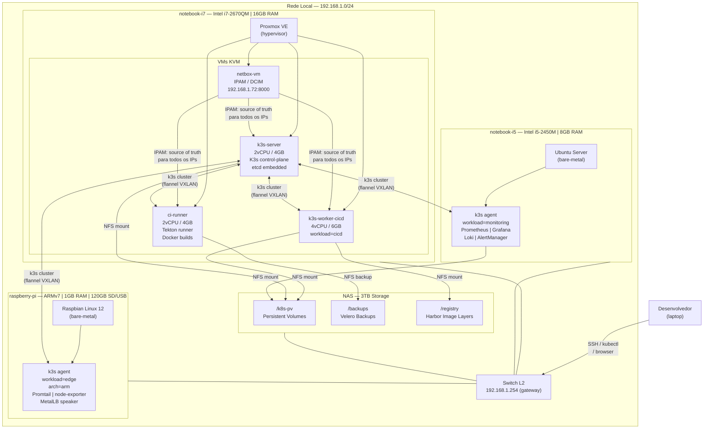
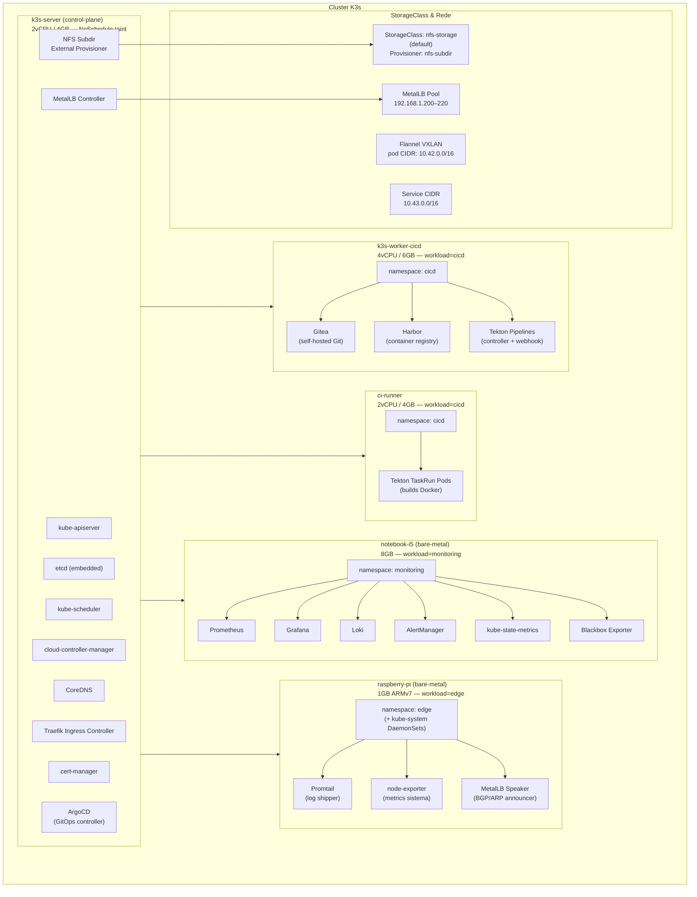
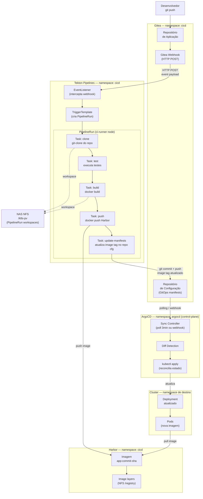
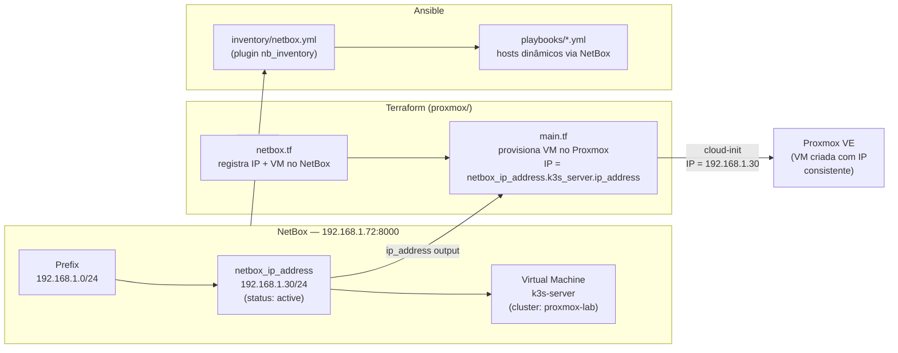

# Arquitetura do Home Lab — Referência Central

> **Versão:** 1.1.0
> **Atualizado em:** 2026-04-24
> **Responsável:** jose.mussauer@stone.com.br

---

## Sumário

1. [Visão Geral](#1-visão-geral)
2. [Inventário de Hardware](#2-inventário-de-hardware)
3. [Topologia Física](#3-topologia-física)
4. [Cluster Kubernetes](#4-cluster-kubernetes)
5. [Fluxo CI/CD](#5-fluxo-cicd)
6. [Monitoramento e Logs](#6-monitoramento-e-logs)
7. [Storage e Rede](#7-storage-e-rede)
8. [Componentes por Namespace](#8-componentes-por-namespace)
9. [Decisões de Design e Trade-offs](#9-decisões-de-design-e-trade-offs)
10. [Pré-requisitos e Ordem de Instalação](#10-pré-requisitos-e-ordem-de-instalação)

---

## 1. Visão Geral

Este laboratório de infraestrutura executa um cluster Kubernetes K3s multi-nó distribuído em hardware heterogêneo (x86_64 e ARMv7), com pipeline CI/CD completo (Gitea + Tekton + Harbor + ArgoCD), monitoramento centralizado (kube-prometheus-stack + Loki) e storage persistente via NAS compartilhado por NFS.

### Princípios adotados

- **GitOps**: toda mudança de estado do cluster passa por repositório Git. Nenhum `kubectl apply` manual em produção.
- **Separação de responsabilidades por nó**: workloads são alocados por `nodeSelector` e `tolerations` para garantir isolamento de recursos.
- **Frugalidade de recursos**: o hardware é de geração anterior (Sandy Bridge, 2011–2012). Cada componente foi selecionado pela relação baixo consumo / alta funcionalidade.
- **Storage centralizado**: todos os dados persistentes residem no NAS via NFS. Nenhum estado crítico sobrevive apenas no disco local de uma VM.
- **Observabilidade desde o início**: node-exporter, Promtail e OTEL são configurados antes dos workloads de aplicação.
- **IPAM centralizado (NetBox)**: todos os endereços IP do laboratório — nós físicos, VMs, serviços LoadBalancer e CIDRs de rede — são registrados e gerenciados no NetBox. O Terraform consulta o NetBox para alocar IPs antes de provisionar VMs, eliminando conflitos e IPs hardcoded no código.

---

## 2. Inventário de Hardware

### 2.1 Hosts físicos

| Host | CPU | Arquitetura | RAM | Armazenamento | Sistema Operacional | Papel |
|---|---|---|---|---|---|---|
| `notebook-i7` | Intel i7-2670QM @2.2GHz (4c/8t) | x86_64 | 16 GB | NAS via NFS | Proxmox VE | Hypervisor — hospeda VMs do control-plane e CI/CD |
| `notebook-i5` | Intel i5-2450M @2.5GHz (2c/4t) | x86_64 | 8 GB | — (sem disco local relevante) | Ubuntu Server (bare-metal) | K3s agent — namespace monitoring |
| `raspberry-pi` | ARMv7 4-core @57bMIPS (BCM2836/2837) | ARMv7 (arm/v7) | 1 GB | 120 GB SD/USB | Raspbian Linux 12 (Bookworm) | K3s agent — namespace edge |
| `nas` | — | — | — | 3 TB (RAID/pool) | NAS OS | Storage: NFS exports para todo o cluster |

### 2.2 Alocação de VMs no Proxmox (notebook-i7 — 16 GB RAM, 8 vCPUs)

| VM | vCPU | RAM alocada | Disco | Papel no cluster |
|---|---|---|---|---|
| `k3s-server` | 2 | 4 GB | NFS (`/k8s-pv`) | K3s control-plane + etcd embedded |
| `k3s-worker-cicd` | 4 | 6 GB | NFS (`/k8s-pv`) | K3s worker — namespace `cicd` |
| `ci-runner` | 2 | 4 GB | NFS (`/k8s-pv`) | Tekton runner + builds Docker |
| `netbox-vm` | 1 | 2 GB | NFS (`/k8s-pv`) | NetBox IPAM — já deployado |
| *(Proxmox overhead)* | — | 2 GB | — | Sistema host Proxmox |
| **Total** | **9** | **18 GB** | — | — |

> **Nota:** a VM `netbox-vm` já estava deployada anteriormente ao setup K3s. Os 16 GB de RAM do `notebook-i7` incluem o overhead dela; as demais VMs foram dimensionadas considerando sua presença.
>
> **Nota de capacidade:** as 8 vCPUs mapeiam diretamente nos 4 cores físicos com HyperThreading. Em carga simultânea de CI (builds Docker são CPU-intensive), espera-se contenção. O scheduler do Linux no Proxmox com KVM mitiga isso, mas builds lentos são esperados quando o pipeline e o control-plane competem por CPU.

---

## 3. Topologia Física

O diagrama abaixo representa a relação entre hardware físico, VMs, sistema operacional e conectividade de rede.



---

## 4. Cluster Kubernetes

### 4.1 Visão dos nós e labels

| Nó | Tipo | Arquitetura | Labels relevantes | Taints |
|---|---|---|---|---|
| `k3s-server` | control-plane | x86_64 | `node-role.kubernetes.io/master=true` | `node-role.kubernetes.io/master:NoSchedule` |
| `k3s-worker-cicd` | worker | x86_64 | `workload=cicd` | — |
| `ci-runner` | worker | x86_64 | `workload=cicd` | — |
| `notebook-i5` | worker | x86_64 | `workload=monitoring` | — |
| `raspberry-pi` | worker | ARMv7 | `workload=edge`, `kubernetes.io/arch=arm` | — |

### 4.2 Diagrama do cluster — nós, namespaces e workloads



### 4.3 Configuração de rede do cluster

| Parâmetro | Valor |
|---|---|
| CNI | Flannel (padrão K3s) — modo VXLAN |
| Pod CIDR | `10.42.0.0/16` |
| Service CIDR | `10.43.0.0/16` |
| DNS Cluster | `10.43.0.10` (CoreDNS) |
| Ingress | Traefik v2 (embutido no K3s) |
| LoadBalancer | MetalLB — L2 mode (ARP) — pool `192.168.1.200–192.168.1.220` |
| TLS | cert-manager com ClusterIssuer (Let's Encrypt ou self-signed CA interna) |
| StorageClass default | `nfs-storage` via NFS Subdir External Provisioner |

---

## 5. Fluxo CI/CD

### 5.1 Descrição do pipeline

O fluxo adota GitOps completo: o estado desejado do cluster é sempre o que está no repositório Git. Nenhuma mudança é aplicada manualmente via `kubectl`.

**Etapas do pipeline:**

1. Desenvolvedor faz `git push` para o repositório de aplicação no Gitea.
2. Gitea dispara webhook HTTP para o Tekton EventListener.
3. Tekton cria um `PipelineRun` com as seguintes `Tasks` em sequência:
   - `clone`: clona o repositório via `git-clone`.
   - `test`: executa testes unitários/integração.
   - `build`: executa `docker build` (multi-platform se necessário).
   - `push`: faz push da imagem para o Harbor com tag `commit-sha`.
   - `update-manifests`: atualiza o campo `image:` nos manifests Kubernetes no repositório de configuração (GitOps repo), via commit automático.
4. ArgoCD detecta o diff no repositório de configuração (polling a cada 3 minutos ou via webhook).
5. ArgoCD aplica o diff no cluster (`kubectl apply` gerenciado).
6. Pods são recriados com a nova imagem puxada do Harbor.

### 5.2 Diagrama do fluxo CI/CD



### 5.3 Acessos e URLs (MetalLB LoadBalancer)

| Serviço | IP MetalLB | Porta | Protocolo |
|---|---|---|---|
| Gitea | `192.168.1.200` | 443 | HTTPS (Traefik Ingress) |
| Harbor | `192.168.1.201` | 443 | HTTPS (Traefik Ingress) |
| ArgoCD UI | `192.168.1.202` | 443 | HTTPS (Traefik Ingress) |
| Tekton Dashboard | `192.168.1.203` | 443 | HTTPS (Traefik Ingress) |

---

## 6. Monitoramento e Logs

### 6.1 Arquitetura de observabilidade

O stack adota os três pilares de observabilidade com ferramentas do ecossistema Prometheus/Grafana:

| Pilar | Ferramenta | Onde roda | Destino |
|---|---|---|---|
| **Metrics** | Prometheus | `notebook-i5` (monitoring) | Coleta todos os nós via scrape |
| **Metrics** | kube-state-metrics | `notebook-i5` (monitoring) | Expõe métricas de objetos K8s |
| **Metrics** | node-exporter | Todos os nós (DaemonSet) | Expõe métricas de hardware/OS |
| **Metrics** | Blackbox Exporter | `notebook-i5` (monitoring) | Healthcheck de endpoints HTTP/TCP |
| **Logs** | Loki | `notebook-i5` (monitoring) | Armazena logs indexados |
| **Logs** | Promtail | Todos os nós (DaemonSet) | Coleta logs e envia ao Loki |
| **Dashboards** | Grafana | `notebook-i5` (monitoring) | Visualização de métricas e logs |
| **Alertas** | AlertManager | `notebook-i5` (monitoring) | Roteamento de alertas (email/webhook) |

### 6.2 Diagrama do fluxo de monitoramento e logs

```mermaid
flowchart TD
    subgraph NODES_ALL["Todos os nós (DaemonSets)"]
        NE_I7["node-exporter\nnotebook-i7 VMs\n:9100"]
        NE_I5["node-exporter\nnotebook-i5\n:9100"]
        NE_RPI["node-exporter\nraspberry-pi (ARMv7)\n:9100"]
        PT_I7["Promtail\nnotebook-i7 VMs\n(coleta /var/log\ne logs containers)"]
        PT_I5["Promtail\nnotebook-i5\n(coleta logs)"]
        PT_RPI["Promtail\nraspberry-pi\n(coleta logs)"]
    end

    subgraph WORKLOADS["Workloads — instrumentados"]
        GITEA_M["/metrics\nGitea"]
        HARBOR_M["/metrics\nHarbor"]
        ARGOCD_M["/metrics\nArgoCD"]
        TEKTON_M["/metrics\nTekton"]
        TRFK_M["/metrics\nTraefik"]
        KSM["kube-state-metrics\n:8080 (objetos K8s)"]
        BBX["Blackbox Exporter\n(probe HTTP/TCP)"]
    end

    subgraph MON_NS["namespace: monitoring — notebook-i5 (8GB)"]
        PROM_SRV["Prometheus\n(scrape + TSDB\n15 dias retenção local)"]
        LOKI_SRV["Loki\n(log storage\nvia NFS /k8s-pv)"]
        GRAF_SRV["Grafana\n(dashboards\n:3000 / Ingress HTTPS)"]
        ALERT_SRV["AlertManager\n(roteamento alertas)"]
        PROM_SRV -->|"query"| GRAF_SRV
        LOKI_SRV -->|"query logs"| GRAF_SRV
        PROM_SRV -->|"firing alerts"| ALERT_SRV
    end

    NE_I7 -->|"scrape :9100"| PROM_SRV
    NE_I5 -->|"scrape :9100"| PROM_SRV
    NE_RPI -->|"scrape :9100"| PROM_SRV
    GITEA_M -->|"scrape"| PROM_SRV
    HARBOR_M -->|"scrape"| PROM_SRV
    ARGOCD_M -->|"scrape"| PROM_SRV
    TEKTON_M -->|"scrape"| PROM_SRV
    TRFK_M -->|"scrape"| PROM_SRV
    KSM -->|"scrape"| PROM_SRV
    BBX -->|"probe results"| PROM_SRV

    PT_I7 -->|"push logs\nHTTP /loki/api/v1/push"| LOKI_SRV
    PT_I5 -->|"push logs"| LOKI_SRV
    PT_RPI -->|"push logs"| LOKI_SRV

    ALERT_SRV -->|"webhook / email"| NOTIF["Notificações\n(email, Slack, webhook)"]

    NFS_MON["NAS NFS\n/k8s-pv\n(Loki chunks + index\nGrafana dashboards)"]
    LOKI_SRV -.->|"PVC"| NFS_MON
    PROM_SRV -.->|"PVC\n(TSDB)"]| NFS_MON

    USER["Engenheiro\nbrowser"] -->|"HTTPS Ingress\n192.168.1.204"| GRAF_SRV
```

### 6.3 Alertas críticos recomendados (AlertManager)

| Alerta | Condição | Severidade |
|---|---|---|
| `NodeDown` | nó sem scrape por > 2 min | critical |
| `HighCPUUsage` | CPU > 90% por > 5 min em qualquer nó | warning |
| `HighMemoryUsage` | RAM > 85% por > 5 min | warning |
| `PVCCapacityHigh` | PVC > 80% de uso | warning |
| `PodCrashLooping` | `kube_pod_container_status_restarts_total` rate > 0.1/min | critical |
| `ArgocdSyncFailed` | `argocd_app_info{sync_status="OutOfSync"}` por > 10 min | warning |
| `TektonPipelineFailed` | pipeline com status Failed | warning |
| `BlackboxProbeDown` | endpoint HTTP/TCP não responde por > 2 min | critical |
| `NASUnreachable` | NFS mount point inacessível | critical |

---

## 7. Storage e Rede

### 7.1 NFS Exports do NAS

| Export | Caminho no NAS | Utilização | Permissão |
|---|---|---|---|
| `k8s-pv` | `/k8s-pv` | Persistent Volumes dinâmicos via NFS Subdir | `rw`, `no_root_squash` |
| `backups` | `/backups` | Velero — backup de PVs e objetos K8s | `rw`, `no_root_squash` |
| `registry` | `/registry` | Harbor — camadas de imagens Docker | `rw`, `no_root_squash` |

> **Segurança:** o NFS expõe apenas para `192.168.1.0/24`. Em ambiente de produção, usar NFS com Kerberos ou substituir por Longhorn/Rook-Ceph. O `no_root_squash` é aceitável em home lab com rede isolada.

### 7.2 StorageClass

```yaml
apiVersion: storage.k8s.io/v1
kind: StorageClass
metadata:
  name: nfs-storage
  annotations:
    storageclass.kubernetes.io/is-default-class: "true"
provisioner: cluster.local/nfs-subdir-external-provisioner
parameters:
  archiveOnDelete: "false"
reclaimPolicy: Delete
volumeBindingMode: Immediate
```

### 7.3 Endereçamento de rede

| Segmento | CIDR | Observação |
|---|---|---|
| Rede local (management) | `192.168.1.0/24` | Todos os hosts físicos e VMs |
| K3s Pod CIDR | `10.42.0.0/16` | Flannel VXLAN — IPs dos Pods |
| K3s Service CIDR | `10.43.0.0/16` | ClusterIP Services |
| MetalLB Pool | `192.168.1.200–192.168.1.220` | LoadBalancer Services (21 IPs) |
| Gateway | `192.168.1.254` | Roteador doméstico |

### 7.4 Velero — estratégia de backup

- **Frequência:** backup diário de todos os namespaces.
- **Retenção:** 7 dias.
- **Destino:** PVC no NFS export `/backups`.
- **Escopo:** objetos Kubernetes + PVs via restic (backup de dados em volume).
- **Comando de restore de emergência:**
  ```bash
  velero restore create --from-backup <nome-do-backup>
  ```

### 7.5 IPAM — NetBox

O NetBox (Network Source of Truth) funciona como a camada de **IPAM (IP Address Management)** do laboratório. Todos os endereços IP, prefixos de rede, VMs e dispositivos físicos são registrados no NetBox antes de serem provisionados.

**VM NetBox no Proxmox:**

| Atributo | Valor |
|---|---|
| Host | `192.168.1.72` |
| Porta | `8000` (HTTP) |
| Deployment | VM no Proxmox (`notebook-i7`) |

**Prefixos gerenciados:**

| Prefixo | Função | Tags |
|---|---|---|
| `192.168.1.0/24` | LAN de gerenciamento — todos os hosts físicos e VMs | `lab`, `management` |
| `192.168.1.200/28` | Pool MetalLB — LoadBalancer Services do K3s | `lab`, `metallb` |
| `10.42.0.0/16` | K3s Pod CIDR (Flannel VXLAN) | `lab`, `k3s-internal` |
| `10.43.0.0/16` | K3s Service CIDR (ClusterIP) | `lab`, `k3s-internal` |

**IPs registrados no NetBox:**

| Endereço | Host/Serviço | Status | Tipo |
|---|---|---|---|
| `192.168.1.20/24` | notebook-i7 (Proxmox host) | Active | Device |
| `192.168.1.65/24` | notebook-i5 (k3s worker monitoring) | Active | Device |
| `192.168.1.72/24` | NetBox IPAM VM | Active | Virtual Machine |
| `192.168.1.76/24` | BookStack (wiki interna) | Active | Virtual Machine |
| `192.168.1.107/24` | HomeAssistant (automação residencial) | Active | Virtual Machine |
| `192.168.1.110/24` | raspberry-pi (k3s worker edge) | Active | Device |
| `192.168.1.112/24` | NAS Storage | Active | Device |
| `192.168.1.30/24` | k3s-server VM | Active | Virtual Machine |
| `192.168.1.31/24` | k3s-worker-cicd VM | Active | Virtual Machine |
| `192.168.1.32/24` | ci-runner VM | Active | Virtual Machine |
| `192.168.1.200/28` | MetalLB — Gitea | Active | LoadBalancer VIP |
| `192.168.1.201/28` | MetalLB — Harbor | Active | LoadBalancer VIP |
| `192.168.1.202/28` | MetalLB — ArgoCD UI | Active | LoadBalancer VIP |
| `192.168.1.203/28` | MetalLB — Tekton EventListener | Active | LoadBalancer VIP |
| `192.168.1.210/28` | MetalLB — Grafana | Active | LoadBalancer VIP |

**Fluxo de provisionamento com IPAM:**



**Inventário dinâmico Ansible via NetBox:**

O arquivo `ansible/inventory/netbox.yml` usa o plugin `netbox.netbox.nb_inventory`. Em vez de um `hosts.yml` estático, o Ansible consulta o NetBox na hora da execução:

```bash
# Usar o inventário dinâmico NetBox:
export NETBOX_URL=http://192.168.1.72:8000
export NETBOX_TOKEN=<token>
ansible-playbook -i inventory/netbox.yml playbooks/01-base-setup.yml

# Verificar hosts detectados:
ansible-inventory -i inventory/netbox.yml --graph
```

**Por que NetBox e não só comentários no código?**

- Detecta conflitos de IP em tempo de `terraform plan` (recurso já existe no estado NetBox)
- Inventário Ansible sempre reflete o estado real — adicionar uma VM no Proxmox automaticamente a expõe para os playbooks após registrar no NetBox
- Documentação visual: dashboard NetBox mostra topologia, prefixos utilizados e hosts ativos
- Base para futuras automações: alertas de IP esgotamento, relatórios de capacidade, integração com DNS

---

## 8. Componentes por Namespace

A tabela abaixo consolida todos os workloads do cluster com estimativas de `requests` e `limits` de memória calibradas para o hardware disponível.

### namespace: `kube-system` (control-plane e infraestrutura)

| Componente | Nó destino | RAM request | RAM limit | Notas |
|---|---|---|---|---|
| CoreDNS | `k3s-server` | 70 Mi | 170 Mi | 2 réplicas recomendadas se possível |
| Traefik | `k3s-server` | 100 Mi | 256 Mi | Ingress controller embutido no K3s |
| Flannel (DaemonSet) | todos os nós | 50 Mi | 100 Mi | Por nó |
| MetalLB Controller | `k3s-server` | 64 Mi | 128 Mi | — |
| MetalLB Speaker (DaemonSet) | todos os nós | 32 Mi | 64 Mi | Inclui RPi ARMv7 |
| NFS Subdir Provisioner | `k3s-server` | 50 Mi | 128 Mi | — |
| cert-manager | `k3s-server` | 64 Mi | 128 Mi | — |
| local-path-provisioner | `k3s-server` | 32 Mi | 64 Mi | Embutido no K3s, mantido como fallback |

### namespace: `cicd`

| Componente | Nó destino | RAM request | RAM limit | Notas |
|---|---|---|---|---|
| Gitea (Deployment) | `k3s-worker-cicd` | 256 Mi | 512 Mi | Banco SQLite ou PostgreSQL (PVC NFS) |
| Harbor core | `k3s-worker-cicd` | 256 Mi | 512 Mi | — |
| Harbor registry | `k3s-worker-cicd` | 128 Mi | 256 Mi | Layers no NFS `/registry` |
| Harbor portal | `k3s-worker-cicd` | 64 Mi | 128 Mi | — |
| Harbor redis | `k3s-worker-cicd` | 64 Mi | 128 Mi | — |
| Harbor database | `k3s-worker-cicd` | 128 Mi | 256 Mi | PostgreSQL embutido ou externo |
| Tekton Pipelines controller | `k3s-worker-cicd` | 100 Mi | 256 Mi | — |
| Tekton Pipelines webhook | `k3s-worker-cicd` | 50 Mi | 128 Mi | — |
| Tekton Triggers controller | `k3s-worker-cicd` | 50 Mi | 128 Mi | — |
| Tekton EventListener | `k3s-worker-cicd` | 50 Mi | 128 Mi | — |
| Tekton TaskRun Pods | `ci-runner` | 256 Mi | 1 Gi | Pods efêmeros — criados por pipeline run |

### namespace: `argocd`

| Componente | Nó destino | RAM request | RAM limit | Notas |
|---|---|---|---|---|
| argocd-server | `k3s-server` | 128 Mi | 256 Mi | API + UI |
| argocd-repo-server | `k3s-server` | 128 Mi | 256 Mi | Clona e renderiza manifests |
| argocd-application-controller | `k3s-server` | 128 Mi | 256 Mi | Reconciliation loop |
| argocd-dex-server | `k3s-server` | 32 Mi | 64 Mi | OIDC (pode ser desabilitado em lab) |
| argocd-redis | `k3s-server` | 32 Mi | 64 Mi | Cache de estado |

### namespace: `monitoring`

| Componente | Nó destino | RAM request | RAM limit | Notas |
|---|---|---|---|---|
| Prometheus | `notebook-i5` | 512 Mi | 1.5 Gi | TSDB local 15 dias; dados em PVC NFS |
| Grafana | `notebook-i5` | 128 Mi | 256 Mi | Dashboards em PVC NFS |
| AlertManager | `notebook-i5` | 64 Mi | 128 Mi | — |
| kube-state-metrics | `notebook-i5` | 64 Mi | 128 Mi | — |
| Loki | `notebook-i5` | 256 Mi | 512 Mi | Chunks em PVC NFS |
| Blackbox Exporter | `notebook-i5` | 32 Mi | 64 Mi | — |
| node-exporter (DaemonSet) | todos os nós | 30 Mi | 64 Mi | Por nó |
| Promtail (DaemonSet) | todos os nós | 50 Mi | 100 Mi | Por nó — inclui RPi ARMv7 |

### namespace: `edge`

| Componente | Nó destino | RAM request | RAM limit | Notas |
|---|---|---|---|---|
| Promtail | `raspberry-pi` | 50 Mi | 100 Mi | DaemonSet — cobre o namespace edge |
| node-exporter | `raspberry-pi` | 30 Mi | 64 Mi | DaemonSet |
| MetalLB Speaker | `raspberry-pi` | 32 Mi | 64 Mi | ARP announcer para o pool MetalLB |

### Resumo de consumo estimado por nó

| Nó | RAM disponível | RAM estimada em uso | Margem |
|---|---|---|---|
| `k3s-server` (VM) | 4 GB | ~1.8 GB (control-plane + argocd + cert-manager) | ~2.2 GB |
| `k3s-worker-cicd` (VM) | 6 GB | ~2.5 GB (Harbor + Gitea + Tekton) | ~3.5 GB |
| `ci-runner` (VM) | 4 GB | ~0.5 GB base + até 1 GB por build | ~2.5 GB livre |
| `notebook-i5` | 8 GB | ~3 GB (monitoring stack) | ~5 GB |
| `raspberry-pi` | 1 GB | ~250 MB (edge agents) | ~750 MB |

---

## 9. Decisões de Design e Trade-offs

### 9.1 Por que K3s em vez de K8s completo?

**Decisão:** K3s (Rancher/SUSE) em vez de kubeadm + full Kubernetes.

| Critério | K3s | kubeadm K8s |
|---|---|---|
| RAM do control-plane | ~512 MB | ~2 GB |
| Suporte ARMv7 | Nativo (binário único) | Requer configuração manual |
| Instalação | Script único | Multi-etapas complexas |
| Traefik + local-path embutidos | Sim | Não |
| Produção enterprise | Não recomendado | Sim |
| etcd embedded | Sim (SQLite ou etcd) | Não |

**Conclusão:** em hardware com 1 GB de RAM (RPi) e CPUs de 2011, K3s é a única escolha viável. O overhead de kubeadm consumiria a margem operacional.

### 9.2 Por que Harbor em vez de Docker Registry v2 simples?

**Decisão:** Harbor como registry privado em vez do `registry:2` oficial.

| Critério | Harbor | registry:2 |
|---|---|---|
| Interface web | Sim | Não |
| RBAC por projeto | Sim | Não |
| Vulnerability scanning | Sim (Trivy integrado) | Não |
| Replication entre registries | Sim | Não |
| RAM (idle) | ~800 MB total (todos componentes) | ~50 MB |
| Complexidade | Alta (múltiplos pods) | Baixa |

**Conclusão:** o custo em RAM é justificado pelo ganho de segurança (scan de vulnerabilidades em imagens é crítico mesmo em home lab) e pela experiência próxima à realidade de produção. O hardware do `k3s-worker-cicd` (6 GB) absorve o custo.

### 9.3 Por que Tekton em vez de Drone CI ou GitHub Actions self-hosted?

**Decisão:** Tekton Pipelines como motor de CI/CD.

| Critério | Tekton | Drone CI | Act (GH Actions) |
|---|---|---|---|
| Nativo Kubernetes | Sim (CRDs) | Parcial | Não |
| Integração ArgoCD | Simples (mesmos manifests) | Requer adaptação | Requer adaptação |
| Curva de aprendizado | Alta | Baixa | Baixa |
| Reutilização de Tasks | Alta (Tekton Hub) | Média | Alta (Marketplace) |
| RAM (controller) | ~150 MB | ~100 MB | ~200 MB |

**Conclusão:** Tekton é mais verboso que Drone, mas alinha o lab com stacks de produção enterprise (Cloud Native CI/CD). A curva de aprendizado é o investimento intencional do laboratório.

### 9.4 Por que ArgoCD em vez de Flux CD?

**Decisão:** ArgoCD para GitOps.

| Critério | ArgoCD | Flux CD |
|---|---|---|
| UI web | Sim (rica) | Não (apenas CLI) |
| Multi-cluster | Sim | Sim |
| RAM (idle) | ~600 MB total | ~300 MB total |
| Modelo mental | App-centric | GitRepository-centric |
| Integração com Helm/Kustomize | Sim | Sim |

**Conclusão:** a UI do ArgoCD é valiosa em ambiente de aprendizado — visualizar o diff de sincronização acelera o diagnóstico. O custo de RAM extra é aceito.

### 9.5 Por que NFS em vez de Longhorn ou Rook-Ceph?

**Decisão:** NFS Subdir External Provisioner apontando para o NAS existente.

| Critério | NFS (NAS existente) | Longhorn | Rook-Ceph |
|---|---|---|---|
| Hardware adicional | Nenhum | Nenhum | Nenhum (mas pesado) |
| RAM por nó | ~50 MB (provisioner) | ~200 MB por nó | ~500 MB+ por nó |
| Resiliência | Ponto único de falha (NAS) | Replicação entre nós | Replicação entre nós |
| CPU em builds | Nenhuma | Baixa | Alta |
| Complexidade operacional | Baixa | Média | Alta |

**Conclusão:** com apenas um NAS e hardware limitado, Longhorn e Ceph consumiriam recursos críticos (especialmente no RPi de 1 GB). O NAS centralizado com backup via Velero é o equilíbrio correto. O ponto único de falha é aceito conscientemente — este é um lab, não produção.

### 9.6 Por que Flannel em vez de Calico ou Cilium?

**Decisão:** Flannel VXLAN (padrão K3s).

**Justificativa:** Calico e Cilium requerem eBPF, que não está disponível no kernel do Raspbian para ARMv7. Flannel funciona em todos os nós do cluster, incluindo o RPi. Network policies avançadas não são requisito do lab.

### 9.7 Limitações conhecidas e riscos

| Limitação | Impacto | Mitigação |
|---|---|---|
| CPUs Sandy Bridge (2011) sem AES-NI moderno | TLS overhead maior | Aceitável em LAN local |
| RPi 1 GB RAM — DaemonSets consomem ~250 MB | ~750 MB para workloads edge | Manter apenas Promtail + node-exporter + MetalLB no RPi |
| NAS ponto único de falha | Perda de todos os PVs | Velero backup diário no mesmo NAS (proteção apenas contra corrupção lógica) |
| k3s-server sem HA (single control-plane) | Cluster indisponível se VM cair | Aceitável para home lab; snapshot diário da VM no Proxmox |
| Build Docker em `ci-runner` sem cache de camadas persistente | Builds lentos | Configurar BuildKit cache via PVC NFS |
| HyperThreading em i7-2670QM para 8 vCPUs | Contenção de CPU em CI | Monitorar `cpu_throttling` no Grafana |

### 9.8 Por que NetBox como IPAM em vez de planilha ou comentários no código?

**Decisão:** NetBox como fonte centralizada de IPs (IPAM + DCIM) em vez de IPs hardcoded no Terraform ou planilha compartilhada.

| Critério | NetBox | IPs hardcoded no TF | Planilha |
| --- | --- | --- | --- |
| Detecta conflitos de IP | Sim (`terraform plan` falha) | Não | Manual |
| Inventário dinâmico Ansible | Sim (plugin nativo) | Não | Não |
| Visualização de topologia | Sim (dashboard) | Não | Parcial |
| Documentação de prefixos | Sim | Não | Manual |
| Integração CI/CD | Sim (API REST) | N/A | Não |
| Overhead de RAM | ~512 MB (VM) | Zero | Zero |

**Conclusão:** o custo de uma VM adicional com 2 GB de RAM é amplamente justificado. Num ambiente com hardware heterogêneo e IPs fixos espalhados entre VMs, bare-metal e serviços LoadBalancer, o NetBox elimina conflitos silenciosos que seriam difíceis de diagnosticar. Como o NetBox já estava deployado no Proxmox lab, o custo incremental é zero.

---

## 10. Pré-requisitos e Ordem de Instalação

A ordem abaixo é obrigatória. Dependências em cadeia tornam inviável pular etapas.

### Fase 0 — Infraestrutura de base

```
[ ] 0. Configurar NetBox IPAM (já deployado — configurar para o lab):
        Acessar: http://192.168.1.72:8000
        Criar site: lab-home
        Criar prefix: 192.168.1.0/24 (status: active)
        Gerar API token em: /user/api-tokens/
        Exportar: export NETBOX_URL=http://192.168.1.72:8000
                  export NETBOX_TOKEN=<token-gerado>
        O Terraform registrará automaticamente VMs e IPs via: terraform apply
[ ] 1. Configurar NAS: criar exports NFS (/k8s-pv, /backups, /registry)
        Verificar: showmount -e <ip-nas> deve listar os 3 exports
[ ] 2. Instalar Proxmox VE no notebook-i7
        Versão recomendada: Proxmox VE 8.x (Debian 12 base)
[ ] 3. Criar VMs no Proxmox via Terraform (k3s-server, k3s-worker-cicd, ci-runner)
        IPs alocados automaticamente via NetBox IPAM (terraform/proxmox/netbox.tf)
        Verificar no NetBox: http://192.168.1.72:8000/ipam/ip-addresses/
        Os IPs 192.168.1.30-22 devem aparecer com status "Active"
[ ] 4. Instalar Ubuntu Server no notebook-i5
        Configurar IP estático em 192.168.1.x
[ ] 5. Verificar Raspbian 12 no raspberry-pi
        Configurar IP estático em 192.168.1.x
        Verificar suporte cgroup v2: cat /proc/cgroups
```

### Fase 1 — Cluster K3s

```
[ ] 6. Instalar K3s server no k3s-server (VM)
        curl -sfL https://get.k3s.io | sh -s - server \
          --cluster-init \
          --disable traefik \   # instalar Traefik via Helm depois para controle de versão
          --node-taint node-role.kubernetes.io/master=:NoSchedule
        Salvar: /var/lib/rancher/k3s/server/node-token

[ ] 7. Instalar K3s agent no k3s-worker-cicd (VM)
        curl -sfL https://get.k3s.io | K3S_URL=https://<k3s-server-ip>:6443 \
          K3S_TOKEN=<node-token> sh -
        kubectl label node k3s-worker-cicd workload=cicd

[ ] 8. Instalar K3s agent no ci-runner (VM)
        (mesmo comando, label workload=cicd)

[ ] 9. Instalar K3s agent no notebook-i5 (bare-metal)
        kubectl label node notebook-i5 workload=monitoring

[ ] 10. Instalar K3s agent no raspberry-pi (bare-metal)
         Usar binário ARMv7: curl -sfL https://get.k3s.io | ... (detecta arch automaticamente)
         kubectl label node raspberry-pi workload=edge kubernetes.io/arch=arm

[ ] 11. Verificar todos os nós: kubectl get nodes -o wide
         Todos devem aparecer em status Ready

[ ] 12. Copiar kubeconfig para a máquina de trabalho
         O arquivo /etc/rancher/k3s/k3s.yaml só existe no k3s-server após a instalação.
         Copie-o para a máquina local antes de executar qualquer comando kubectl ou helm:

         Linux/macOS:
           ./scripts/get-kubeconfig.sh
           export KUBECONFIG=~/.kube/infra-lab.yaml

         Windows (PowerShell):
           .\scripts\get-kubeconfig.ps1
           $env:KUBECONFIG = "$env:USERPROFILE\.kube\infra-lab.yaml"

         Verificar: kubectl get nodes -o wide
```

### Fase 2 — Infraestrutura do cluster

```
[ ] 13. Instalar Helm (na máquina de trabalho ou no k3s-server)
         curl https://raw.githubusercontent.com/helm/helm/main/scripts/get-helm-3 | bash

[ ] 14. Instalar NFS Subdir External Provisioner
         helm repo add nfs-subdir-external-provisioner \
           https://kubernetes-sigs.github.io/nfs-subdir-external-provisioner/
         helm install nfs-provisioner nfs-subdir-external-provisioner/nfs-subdir-external-provisioner \
           --set nfs.server=<ip-nas> \
           --set nfs.path=/k8s-pv \
           --set storageClass.defaultClass=true
         Verificar: kubectl get storageclass

[ ] 15. Instalar MetalLB
         helm repo add metallb https://metallb.github.io/metallb
         helm install metallb metallb/metallb -n metallb-system --create-namespace
         Aplicar IPAddressPool e L2Advertisement com range 192.168.1.200-220

[ ] 16. Instalar Traefik (via Helm, versão controlada)
         helm repo add traefik https://helm.traefik.io/traefik
         helm install traefik traefik/traefik -n kube-system

[ ] 17. Instalar cert-manager
         helm repo add jetstack https://charts.jetstack.io
         helm install cert-manager jetstack/cert-manager \
           --namespace cert-manager --create-namespace \
           --set installCRDs=true
         Criar ClusterIssuer (self-signed ou Let's Encrypt)
```

### Fase 3 — Stack CI/CD

```
[ ] 18. Instalar Gitea
         helm repo add gitea-charts https://dl.gitea.io/charts/
         helm install gitea gitea-charts/gitea -n cicd --create-namespace
         Configurar Ingress e PVC (StorageClass nfs-storage)
         Criar repositórios: app-repo e gitops-manifests

[ ] 19. Instalar Harbor
         helm repo add harbor https://helm.goharbor.io
         helm install harbor harbor/harbor -n cicd \
           --set persistence.persistentVolumeClaim.registry.storageClass=nfs-storage \
           --set expose.ingress.hosts.core=harbor.<dominio-local>
         Criar projeto no Harbor para imagens do lab

[ ] 20. Instalar Tekton Pipelines
         kubectl apply -f https://storage.googleapis.com/tekton-releases/pipeline/latest/release.yaml
         Instalar Tekton Triggers:
         kubectl apply -f https://storage.googleapis.com/tekton-releases/triggers/latest/release.yaml
         Instalar Tekton Dashboard (opcional, mas recomendado):
         kubectl apply -f https://storage.googleapis.com/tekton-releases/dashboard/latest/release.yaml
         Criar Pipeline, Tasks e EventListener para o fluxo descrito na Seção 5

[ ] 21. Instalar ArgoCD
         kubectl create namespace argocd
         kubectl apply -n argocd -f \
           https://raw.githubusercontent.com/argoproj/argo-cd/stable/manifests/install.yaml
         Criar Ingress para ArgoCD UI
         Registrar repositório gitops-manifests do Gitea no ArgoCD
         Criar Application apontando para o repositório
```

### Fase 4 — Monitoramento e Logs

```
[ ] 22. Instalar kube-prometheus-stack (Prometheus + Grafana + AlertManager)
         helm repo add prometheus-community https://prometheus-community.github.io/helm-charts
         helm install kube-prometheus-stack \
           prometheus-community/kube-prometheus-stack \
           -n monitoring --create-namespace \
           --set prometheus.prometheusSpec.nodeSelector.workload=monitoring \
           --set grafana.nodeSelector.workload=monitoring \
           --set alertmanager.alertmanagerSpec.nodeSelector.workload=monitoring
         Configurar PVCs via nfs-storage para Prometheus TSDB e Grafana

[ ] 23. Instalar Loki + Promtail
         helm repo add grafana https://grafana.github.io/helm-charts
         helm install loki grafana/loki-stack \
           -n monitoring \
           --set loki.persistence.enabled=true \
           --set loki.persistence.storageClassName=nfs-storage \
           --set promtail.enabled=true
         Verificar Promtail DaemonSet em todos os nós (incluindo RPi)

[ ] 24. Instalar Blackbox Exporter
         helm install prometheus-blackbox-exporter \
           prometheus-community/prometheus-blackbox-exporter \
           -n monitoring
         Criar ProbeRules para Gitea, Harbor, ArgoCD

[ ] 25. Configurar Alertas no AlertManager
         Criar alertas listados na Seção 6.3
         Configurar receiver (email ou webhook)

[ ] 26. Importar dashboards no Grafana
         Dashboard ID 1860 (Node Exporter Full)
         Dashboard ID 13332 (Loki Logs)
         Dashboard ID 14584 (ArgoCD)
         Dashboard ID 9628 (Harbor)
         Dashboard ID 16611 (Tekton)
```

### Fase 5 — Backup

```
[ ] 27. Instalar Velero
         helm repo add vmware-tanzu https://vmware-tanzu.github.io/helm-charts
         helm install velero vmware-tanzu/velero \
           -n velero --create-namespace \
           --set configuration.backupStorageLocation.provider=community.velero.io/nfs \
           --set configuration.backupStorageLocation.bucket=/backups \
           --set initContainers[0].name=velero-plugin-for-nfs...
         Criar BackupSchedule diário: velero schedule create daily-backup \
           --schedule="0 2 * * *" --ttl 168h

[ ] 28. Validar backup e restore em ambiente de teste
         velero backup create test-backup --include-namespaces cicd
         Simular falha e executar: velero restore create --from-backup test-backup
```

### Fase 6 — Validação final

```
[ ] 29. Executar pipeline end-to-end:
         git push → verificar webhook no Gitea
         → verificar PipelineRun no Tekton Dashboard
         → verificar imagem no Harbor
         → verificar commit de atualização no gitops-manifests
         → verificar sync no ArgoCD
         → verificar Pod com nova imagem no cluster

[ ] 30. Validar monitoramento:
         Desligar um nó e verificar alerta NodeDown no AlertManager
         Verificar logs do nó no Grafana/Loki

[ ] 31. Documentar IPs e credenciais no gerenciador de senhas (nunca em Git)
```

---

## Referências

| Componente | Documentação oficial |
|---|---|
| K3s | https://docs.k3s.io |
| MetalLB | https://metallb.universe.tf |
| Cert-manager | https://cert-manager.io/docs |
| NFS Subdir Provisioner | https://github.com/kubernetes-sigs/nfs-subdir-external-provisioner |
| Harbor | https://goharbor.io/docs |
| Gitea | https://docs.gitea.com |
| Tekton | https://tekton.dev/docs |
| ArgoCD | https://argo-cd.readthedocs.io |
| kube-prometheus-stack | https://github.com/prometheus-community/helm-charts/tree/main/charts/kube-prometheus-stack |
| Loki | https://grafana.com/docs/loki/latest |
| Velero | https://velero.io/docs |
| Proxmox VE | https://pve.proxmox.com/wiki/Main_Page |
| NetBox | <https://docs.netbox.dev> |
| NetBox Ansible Collection | <https://docs.ansible.com/ansible/latest/collections/netbox/netbox> |
| Terraform NetBox Provider | <https://registry.terraform.io/providers/e-brains-de/netbox> |
